# Sentence Similarity Identifier (Natural Language Processing)

Final project of Natural language processing course at Cracow University of Technology. 
* The purpose of the project is to explore different nlp statistical and machine learning methods and techniques, such as preprocessing, stemming, tokenization, concepts like Data Scraping, BoW, n-grams, exploring nlp algorithms like Word2Vec, CBOW, GloVe, Gensim, FastText and basic text generation.
* To perform Semantic Analysis and identify similarity between sentences with statistical and machine learning methods.

**For a more detailed description open [report](Burchakov_Ermolaev_PJN.pdf)**

## Steps:
### Preprocessing

* Remove Stopwords
* Expand Contractions
* Remove possessive endings
* Lemmatization
* Remove special characters
* Preserve capitalizations
* Capitalize Named Entities
* Tokenization

### Applying Statistical Methods
#### Word Embedding methods
> *Because the Word2Vec family of models is unsupervised, we can just give it a corpus
without additional labels or information and it can construct dense word embeddings
from the corpus.*
>
> Dipanjan Sarkar - Text Analytics with Python

> *These models are based on the principle of distributional hypothesis in the field of
distributional semantics, which tells us that words that occur and are used in the same
context are semantically similar to one another and have similar meanings (“a word is
characterized by the company it keeps”)*
>
> Dipanjan Sarkar - Text Analytics with Python

#### Gensim Word2Vec
  
After training gensim's Word2Vec model, we may visualize specific words on the graph of their semantic similarities based on context
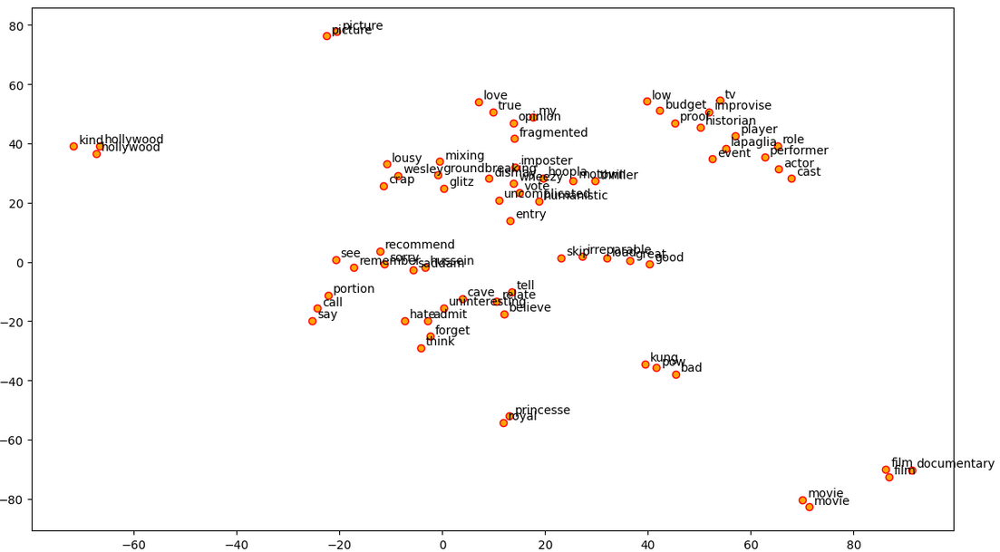

We may calculate the semantic difference of sentences separately word by word, as well as using cosine similarity measure

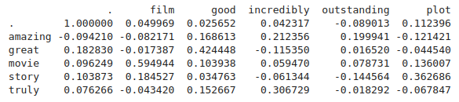
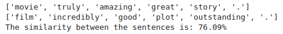

#### GloVe

GloVe is both an unsupervised method and a model.
GloVe method looks for co-occurence and relashionships between words in the entire corpus.

For example, considering how frequently words like "ice" and "steam" co-occur with other words like "solid" or "gas". 

The probe word "solid" is expected to co-occure more often with the word "ice", than the words "steam".

If the probe word is related to both or neither, e.g "water" and "fashion", the expected occurence probability ratio is expected to be close to 1.

>
> The relationship of these words can be examined
by studying the ratio of their co-occurrence prob-
abilities with various probe words*
>
> **[GloVe: Global Vectors for Word Representation. Jeffrey Pennington et al.](https://nlp.stanford.edu/pubs/glove.pdf)**
>

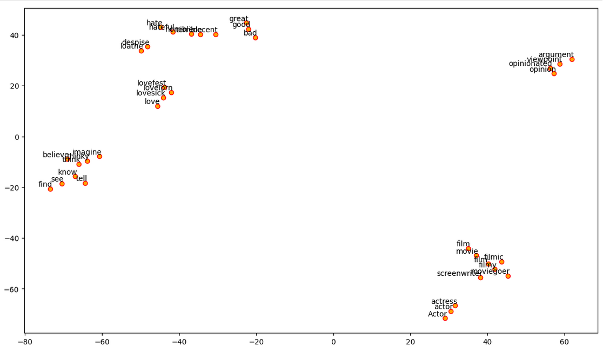
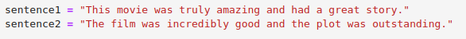

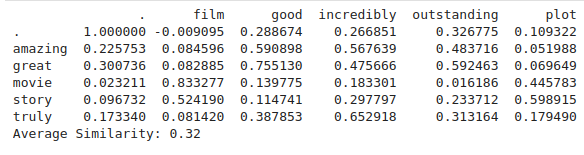

#### FastText
>
> Most of these techniques represent each word of
the vocabulary by a distinct vector, without parameter sharing. In particular, they ignore the internal
structure of words, which is an important limitation
for morphologically rich languages, such as Turkish or Finnish... Because many word formations follow
rules, it is possible to improve vector representations
for morphologically rich languages by using charac-
ter level information.
>
> ...we propose to learn representations
for character n-grams, and to represent words as the
sum of the n-gram vectors
>
> [**Enriching Word Vectors with Subword Information. Piotr Bojanowski et al**](https://arxiv.org/pdf/1607.04606v2.pdf)

Facebook reaserchers provide [open-source](https://fasttext.cc/docs/en/crawl-vectors.html) pre-trained models in 157 languages, one of which is used in this project.

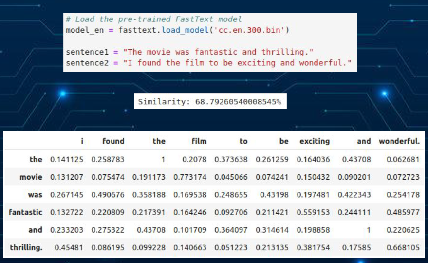

We came to the conclusion that, though the model is already trained, it may require additional training for our specific problem. For our small problem, Facebook's FastText models do not exhibit superiority.

### Applying Machine Learning Seq2Seq model
#### Natural Language Generation
We've experimented with different Neural Network configurations. Our results largely depended on the data used for training, number of layers of the NN and configurations as well as number of training epochs.

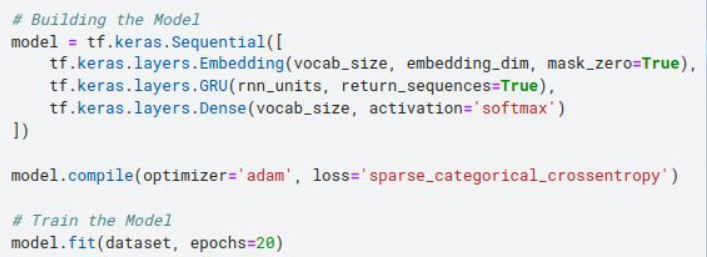
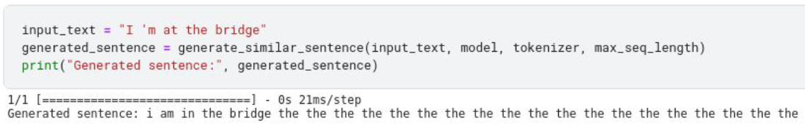
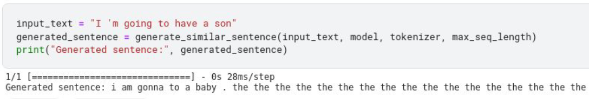
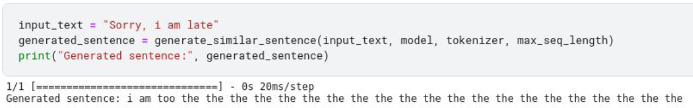
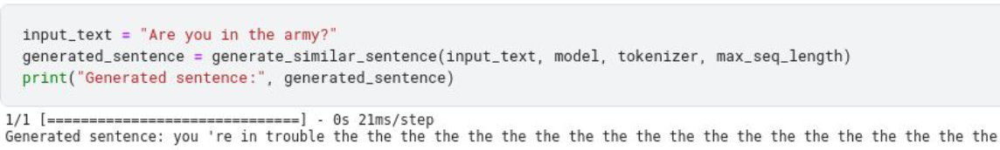
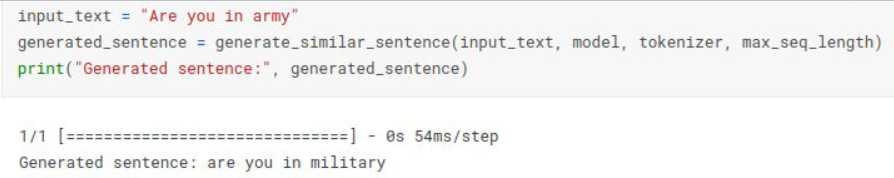
